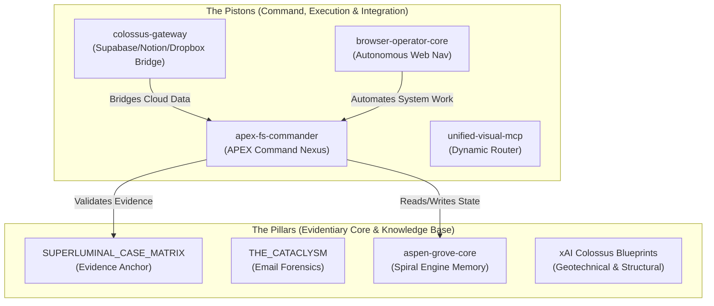

# APEX System Matrix: Pillars & Pistons

> 🛡️ **CASE REF:** 1FDV-23-0001009 | **STATUS:** SEVERE PERSISTENCE ENABLED
> **ACTIVE NODE:** overleaf-mcp

This document details the global architectural alignment of all 29 repositories within the APEX / GodMind system. It establishes how this repository aligns with the "Pillars" (isolated operational domains) and "Pistons" (execution modules bridging the domains).

---

## 1. Global Topology Overview

---

## 2. Core Architectural Alignment

### 🏛️ The Pillars (Static Knowledge, Evidence & Infrastructure)
*   **Case Evidence & Forensics**: `SUPERLUMINAL_CASE_MATRIX`, `THE_CATACLYSM`, `Z-BACKUP-FEDERAL-FORENSIC-REPAIR-OMNIBUS`.
*   **APEX Swarm Core & Memory**: `aspen-grove-core`, `God-Mind`.
*   **xAI Colossus Infrastructure Blueprints**: `xai-colossus-build`, `xai-colossus-energy`, `xai-colossus-nanosphere`, `xai-colossus-cooling`, `xai-colossus-security`, `xai-colossus-servers`, `xai-colossus-waterplant`.
*   **Libraries**: `Pieces-documentation`, `langgraph`, `langgraphjs`, `activepieces`, `pipecat`.

### ⚡ The Pistons (Active Integration, Execution & Command)
*   **Command & Forensics Control**: `apex-fs-commander` (FFRO Hub), `browser-operator-core`.
*   **Gateway Relays & Swarm Bridges**: `colossus-gateway`, `unified-visual-mcp`, `Alex_MCPSuperAssistant`, `overleaf-mcp`, `mcp-playwright`, `supabase`, `mastermind`, `plate`.

---

## 3. Node Integration Strategy
This node (`overleaf-mcp`) is officially registered as part of the APEX system. Any autonomous agent or subagent executing inside this folder must align its actions with the global parameters and register findings back to the `mycorrhizal_network.json` ledger.
